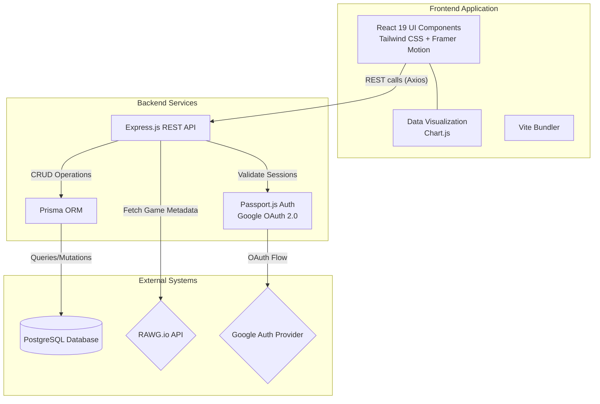
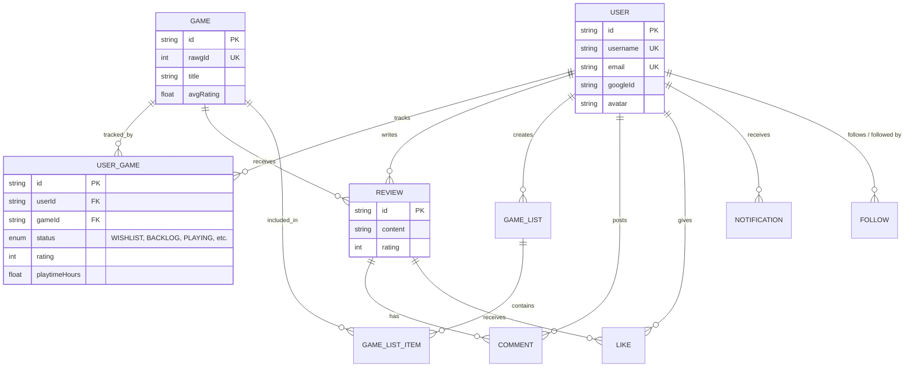

# 🎮 GameLog


GameLog is a full-stack web application designed as the ultimate hub for gamers. Often described as **"Letterboxd for video games"**, it allows users to track their gaming backlogs, rate titles, discover new experiences, and seamlessly connect with friends in a community-driven environment.

## ✨ Features

- **Extensive Database Integration**: Instantly search and fetch rich, real-time game metadata via the powerful [RAWG API](https://rawg.io/apidocs).
- **Personalized Library Management**: Organize your gaming journey using custom statuses:
  - 🌟 *Wishlist*
  - 📚 *Backlog*
  - 🕹️ *Playing*
  - ✅ *Completed*
  - 🛑 *Abandoned*
- **Social Ecosystem**: Keep up with friends via a dynamic social feed. Follow users, comment on reviews, and like updates.
- **Deep Analytics**: Gain insights into your gaming habits with interactive visualizations powered by Chart.js. Track rating distributions and playtime statistics!
- **OAuth Authentication**: Robust and secure user authentication via Passport.js (Google OAuth & local session management).

---

## 🏗️ System Architecture

GameLog follows a decoupled client-server architecture, relying on REST APIs for frontend-backend communication. The backend connects directly to a PostgreSQL database via Prisma ORM while bridging external data from the RAWG API.



---

## 🗄️ Database Schema

The core foundation relies on a relational Postgres database, mapping users, their game correlations, reviews, social graph (follower dynamics), and real-time notifications.



---

## 🛠️ Tech Stack

### Frontend Client
- **Framework:** React 19 optimized via top-tier React Compiler setups.
- **Build Tool:** Vite for blazing fast HMR.
- **Styling:** Tailwind CSS integrated with Framer Motion for liquid-smooth animations.
- **Routing:** React Router v6.
- **Data Visualization:** Chart.js & react-chartjs-2.

### Backend Infrastructure
- **Server:** Node.js with Express.js.
- **Storage:** PostgreSQL combined with Prisma ORM for type-safe database queries.
- **Security & User Sessions:** `bcrypt` for local hashing, `passport` / `passport-google-oauth20` for authentication flows, backed by `express-session`.

---

## 🚀 Local Setup & Getting Started

### 1. Prerequisites
Ensure you have the following installed onto your system:
- **Node.js**: Version 18.x or newer.
- **PostgreSQL**: Running locally or via a cloud instance (e.g., Supabase / Neon).

### 2. Environment Variables Configuration
Duplicate the provided example environment setup at the root directory:

```bash
cp .env.example .env
```
Once copied, edit `.env` and fill out the critical items:
- `DATABASE_URL`: Connection string pointing to your PostgreSQL instance.
- `RAWG_API_KEY`: API key grabbed from [RAWG Developer Portal](https://rawg.io/apidocs).
- Google OAuth Client ID and Secret (If you wish to test OAuth).

### 3. Installation
You'll need two terminal windows actively open to run both halves of the project concurrently.

**Bootstrapping the Backend:**
```bash
cd backend
npm install

# Push the schema structure into your database
npx prisma db push

# Generate Prisma Client & seed the database if needed
npx prisma generate
```

**Bootstrapping the Frontend:**
```bash
cd frontend
npm install
```

### 4. Running the Development Servers

**Start backend API server:**
```bash
cd backend
npm run dev
# The backend will default to http://localhost:3000
```

**Start frontend React server:**
```bash
cd frontend
npm run dev
# The frontend client will run on http://localhost:5173
```

---

## 🤝 Contribution

1. Fork the Project
2. Create your Feature Branch (`git checkout -b feature/AmazingFeature`)
3. Commit your Changes (`git commit -m 'Add some AmazingFeature'`)
4. Push to the Branch (`git push origin feature/AmazingFeature`)
5. Open a Pull Request

---

*Happy Gaming, and may your backlog shrink!* 🕹️🚀
