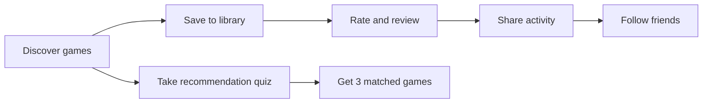
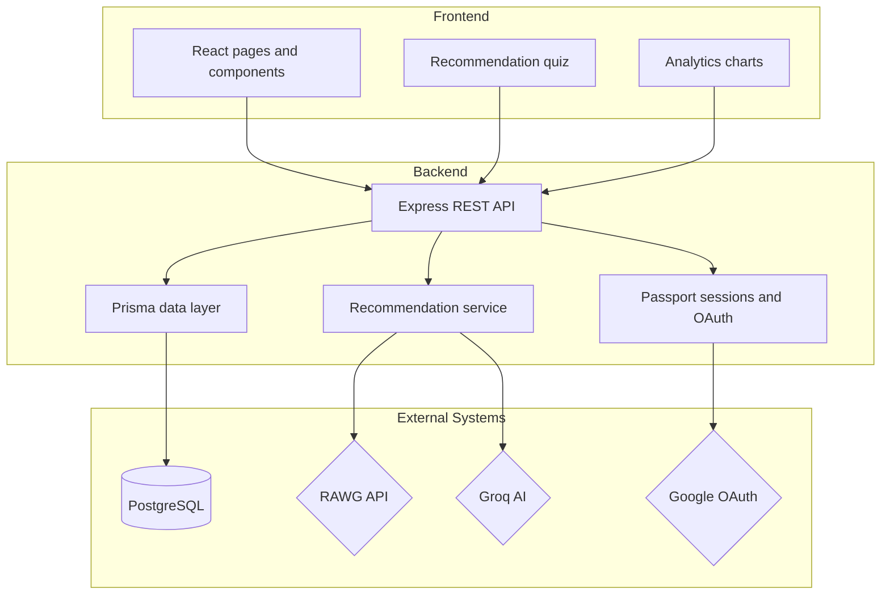
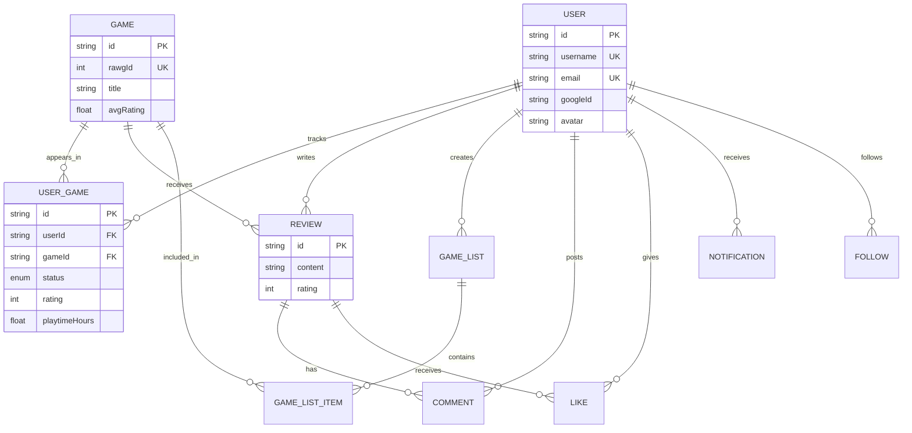
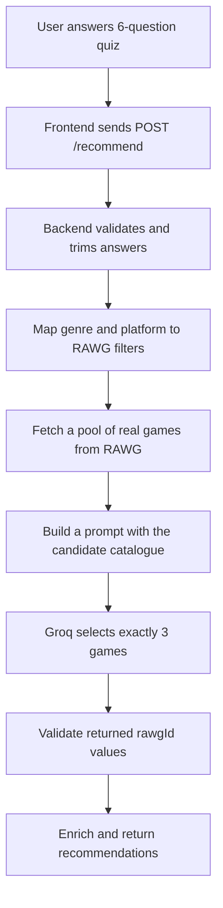
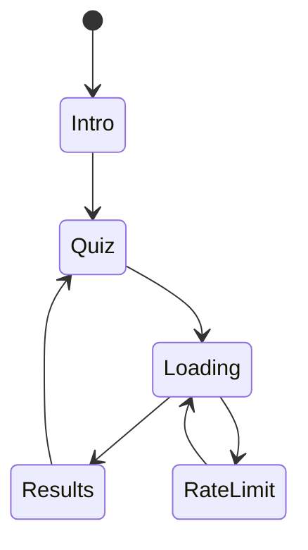

# 🎮 GameLog


GameLog is a full-stack gaming journal and discovery app. It mixes a social feed, personal game tracking, review writing, analytics, and AI-powered recommendations into one place. The easiest shorthand is still “Letterboxd for video games,” but the app is really a complete backlog manager with a social layer and a recommendation engine built around real game data.


## Casual Retrospective


From December into February, the main thing I solved was the feeling that the app had data, but not enough direction. The library and review flows already worked, but everything felt like separate screens instead of one connected game log. I tightened the structure so the whole thing reads more like a single journey: discover a game, save it, play it, talk about it, and then see what that history means later.

The recommendation system was the part that finally made the app feel opinionated. Instead of throwing random AI output at the user, it now starts with real RAWG results, filters them by the user’s answers, and only then lets the model rank and explain the picks. That gave the feature a better personality. It feels less like a chatbot and more like a game clerk who actually knows the shelf.

By February, the experience felt much more complete. The social feed, analytics, and recommendation quiz stopped feeling like extras and started behaving like the same product. The app now has a cleaner rhythm, better guardrails, and a more obvious reason to exist beyond just storing game data.

i was doing the feed flitering like click on tag and that type of feed will appear that seems easy just a client side thing

Why it's not just client-side filtering: I first tried filtering type/following purely in the browser over the already-fetched feed (simpler, no backend touch) but this demo dataset has all 152 reviews clustered older than the 575 most recent logs, so a client-side "Reviews" filter would've needed ~72 sequential page-fetches before showing a single card. Moved that filtering into the DB query instead, so every tab returns real data on the first request. Verified via curl and Playwright: all five tags now populate instantly with correct counts (152 reviews, 575 logs, 358 following-scoped items), each with a tailored empty-state message. No overflow or console errors on mobile or desktop, lint is clean, and the production build still succeeds.

## What The App Does

GameLog lets a user search games, save them to a personal library, track status changes, rate what they played, write reviews, and follow other players. The app also shows charts and summaries so people can see patterns in their taste over time. On top of that, the recommendation page asks a short quiz and returns three curated games that fit the answer set.

Think of the product like this:



## How Everything Works

The frontend is a React app built with Vite and styled with Tailwind CSS. It handles the quiz, the social UI, the charts, the review flows, and the navigation between pages. The backend is an Express API that handles authentication, game search, list management, reviews, notifications, analytics, and recommendations. Prisma sits in the middle as the type-safe bridge to PostgreSQL.



### Main User Loop

1. A user signs in through the auth flow.
2. They search for a game or browse social content.
3. They add games to their list and update statuses like wishlist, backlog, playing, completed, or abandoned.
4. They rate games, leave reviews, and interact with other users.
5. Analytics turn that history into charts and summaries.
6. The recommendation quiz turns the user’s mood and preferences into three concrete game picks.

## Data Model

The database centers on users, games, their library entries, reviews, follows, likes, comments, notifications, and lists. The goal is to preserve a clean social graph while still keeping the core game-tracking experience fast and easy to query.



## Recommendation System

The recommendation flow is deliberately structured so the AI never invents random games. It starts from a real RAWG result set, then asks Groq to pick from that limited pool.



The implementation lives in [backend/src/services/recommendation.service.js](backend/src/services/recommendation.service.js) and is triggered by [backend/src/routes/recommend.routes.js](backend/src/routes/recommend.routes.js). The frontend quiz lives in [frontend/src/pages/Recommend.jsx](frontend/src/pages/Recommend.jsx) and posts to the API through [frontend/src/api/recommendApi.js](frontend/src/api/recommendApi.js).

Here is the actual logic in plain language:

1. The user answers mood, time available, genre, play style, platform, and streamer preference.
2. The backend checks that the payload is present and that every required field is a non-empty string.
3. The service converts genre and platform answers into RAWG query filters.
4. RAWG returns a pool of real games, usually ordered by rating.
5. A prompt is built that includes only that catalogue and instructs Groq to return exactly three picks.
6. Groq responds with IDs, reasons, tags, a stream-friendly flag, and a match score.
7. The service verifies that every returned ID exists in the RAWG pool before accepting it.
8. If the AI response is bad or incomplete, the service falls back to the first three real games from the pool.

That structure matters because it keeps the system useful and grounded. The AI explains and ranks, but the app still controls the source of truth. In other words, the model can choose, but it cannot hallucinate games outside the fetched catalogue.

## Recommendation UI

The quiz is a six-step experience with an intro screen, animated transitions, a loading state, a results state, and a rate-limit recovery screen. The result cards show the title, metadata, explanation, tags, streamability, and score so the user gets both the suggestion and the reasoning behind it.



## Tech Stack

### Frontend

- React 19 for the UI layer.
- Vite for fast builds and refreshes.
- Tailwind CSS for styling.
- Framer Motion for page transitions and quiz animation.
- Chart.js for analytics visualizations.
- React Router for navigation.

### Backend

- Node.js and Express for the API.
- Prisma for database access.
- PostgreSQL for persistent storage.
- Passport.js and express-session for authentication.
- RAWG API for game metadata.
- Groq for AI recommendation ranking and explanation generation.

## Local Setup

### Prerequisites

- Node.js 18 or newer.
- PostgreSQL running locally or through a hosted service.

### Environment

Copy your environment template and fill in the values your deployment needs.

```bash
cp .env.example .env
```

Important variables include `DATABASE_URL`, `RAWG_API_KEY`, and the Google OAuth credentials if you want sign-in to work end to end.

### Install Dependencies

Run both halves of the project separately.

```bash
cd backend
npm install
npx prisma db push
npx prisma generate
```

```bash
cd frontend
npm install
```

### Run Locally

```bash
cd backend
npm run dev
```

```bash
cd frontend
npm run dev
```

The backend defaults to `http://localhost:3000`, and the frontend defaults to `http://localhost:5173`.


## Contribution

1. Fork the project.
2. Create a feature branch.
3. Make your changes.
4. Open a pull request.

---

Happy gaming, and may your backlog shrink.
